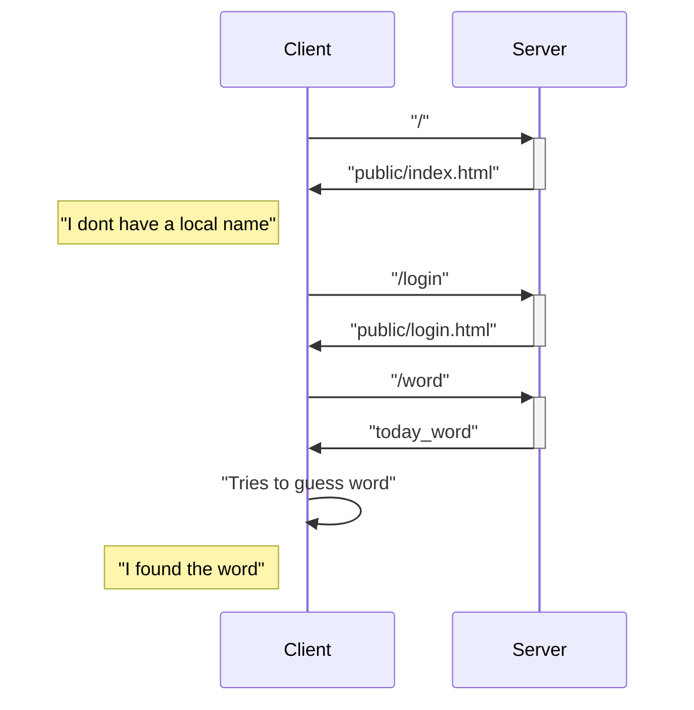
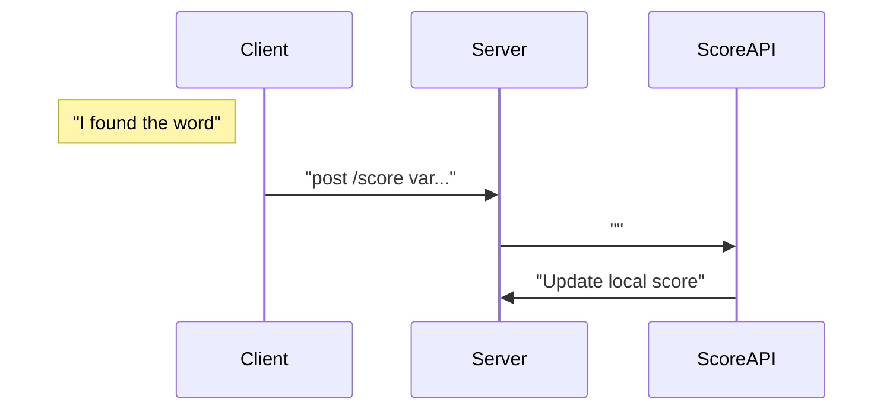
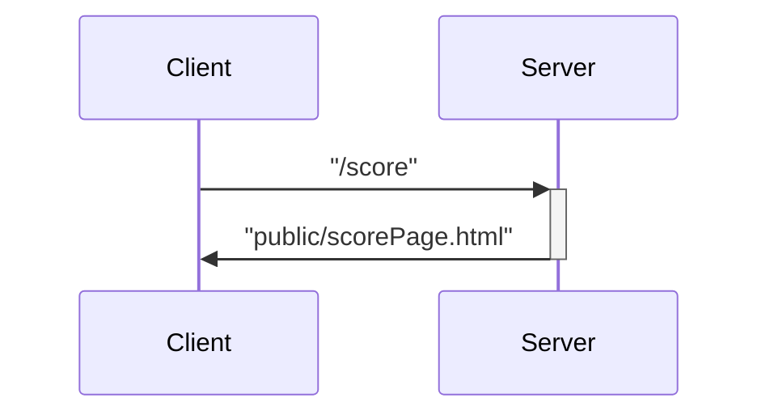

# Sutom-nathan-leo

## Présentation du projet

Le but du projet est de créer une version simplifié du sutom en séparant l'architecture de l'application en différents micro services. Le site se compose d'une page principale sur laquelle l'utilisateur peut jouer au jeu, marquer un mot, deviner et acceder à son tableau de score. S'il ne possède pas de pseudo, il sera automatiquement ammené sur la page de login pour en choisir un.

## Présentation des features

### Jeu

Lorsque la page d'accueil est prête :

#### Login
La variable localStorage "name" est testé. Si elle est vide, alors le client appelle le serveur pour avoir l'url "/login". Le serveur renvoit à ce moment la page login.html. Cette dernière affiche une boite de texte dans laquelle l'utilisateur peut entrer le nom qu'il veut. Puis, il initialise les variables locales suivantes : 
1. "name"
2. "previousWord"
3. "scores"
4. "avgTry"
5. "nbTry"

Enfin, il redirige vers la page d'accueil.

 
#### Get word

Le client appelle le serveur pour récuperer le mot du jour. Celui-ci utilise une liste de mots valides et , à l'aide d'un algorithme de choix, renvoie un mot au client.

---
### API score

---
### Page des scores

